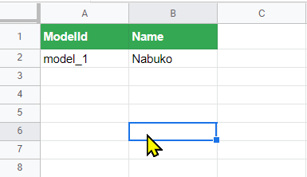
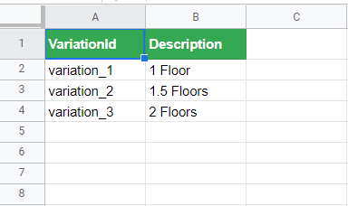
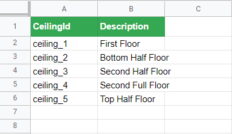

<a href=".\Documentation.md">Go Back</a>

<h2>Planning Documents</h2>

Before starting to work on the 3D Models and the app itself, it's recommended that you fill out a <a href="https://docs.google.com/spreadsheets/d/1tirKEcfqgEeAbgIboBKJhHMu6JjnoDh1ypMFOgjFHaI/edit?usp=sharing">Materials and Selections</a> document and a <a href="https://docs.google.com/spreadsheets/d/1TJ2FMF50aW9vsFhHdnmLKUKm8cefDa5NJK4YjgLp7M8/edit?usp=sharing">Configuration Ids</a> spreadsheet to plan everything out.

<em>Materials And Selections</em> may be (and it's advised for it to be) shared among all models and projects, as it will be common to use the same Materials and Selections in several models.

The <em>Configuration Ids</em> spreadsheet is unique per model, so you need to make a copy for every different model that you want to configure

Having these documents as reference will facilitate the process of optimizing 3D models and configuring the behavior of the app.

> All the screenshots show the documents used for the Nabuko model.

***

<h3>Materials And Selections</h3>

This document contains Ids for all the Materials and Selections that can be used in the app.

<strong>Materials</strong> can be applied to meshes in UE to change their appearance. <strong>Selections</strong> define whether an object is included in the final design or not. Visually, this is represented as showing or hiding a specific mesh.

<h5>MaterialIds</h5>

The <em>MaterialIds</em> Tab looks something like this:

MaterialIds need to be defined in order to pair them up with multiple configuration options inside of the app (see <a href=".\MaterialsAndSelections.md">Materials and Selections</a> for more information about these options). The names in the Material column are only for reference and for people to be able to identify them easily.

<h5>SelectionIds</h5>

SelectionIds define whether an object should be included or not in the final design. For this reason, there are only two options available: <strong>True</strong> and <strong>False</strong>.

> It's important to realize that it's a good idea to share Material and Selection Ids among all projects and models. Thus, a single document should suffice for everyone.

***

<h3>Configuration Ids</h3>

This document should be unique to each project and model, as it defines specific behaviors inside of the app. Here's a tour of all of the Tabs included in this document:

<h5>ModelIds</h5>

The first tab, <em>ModelIds</em>, looks like this:

In here, you define the Ids for the models that you're going to configure. These Ids correspond to specific levels in UE.

<h5>VariationIds</h5>

These Ids represent the variations that a single model may have. For example, different number of floors, different layouts, etc. In UE, these variationIds are used to decide which meshes to show and which to hide.

<h5>SectionIds</h5>

SectionIds represent different well-defined sections of the model. For example, for Nabuko we divided the model into 5 sections, each one representing a floor. VariationIds are paired to different combinations of SectionIds, to figure out which Sections should be visible and which ones hidden.

<h5>CeilingIds</h5>

In order for aerial shots to work, we sometimes need to hide the ceilings. In order to do this, we need to assign a CeilingId to all meshes that we need to show/hide.

<h5>CameraIds</h5>

We will need a lot of Cameras for the Configuration Phase of the app. Each Camera needs its own CameraId for this reason. The column <em>Camera Name</em> can contain either the actual name of the Camera in the Outliner or a reference name that is easy to understand.

<h5>OptionIds</h5>

OptionIds are what actually define how the Configuration process will work. Each Option represents a decision that the user will need to make in order to design their dream home. Options come in two flavors:

- Materials
- Selections

<strong>Material</strong> Options define which Material will be ultimately attached to a certain object.

<strong>Selection</strong> Options define whether an object will be included or not in the final design.

As you can see in the screenshot, the <em>Description</em> column describes the Mesh that will be configured and whether the Option is a Material or a Selection. The flavor of the Option needs to be defined explicitly in UE.

***

Now that you know all about how to use the Planning Documents, you can either go back to the <a href=".\Documentation.md">Main Menu</a> or continue to <a href=".\MaterialsAndSelections.md">Materials and Selections</a>.
